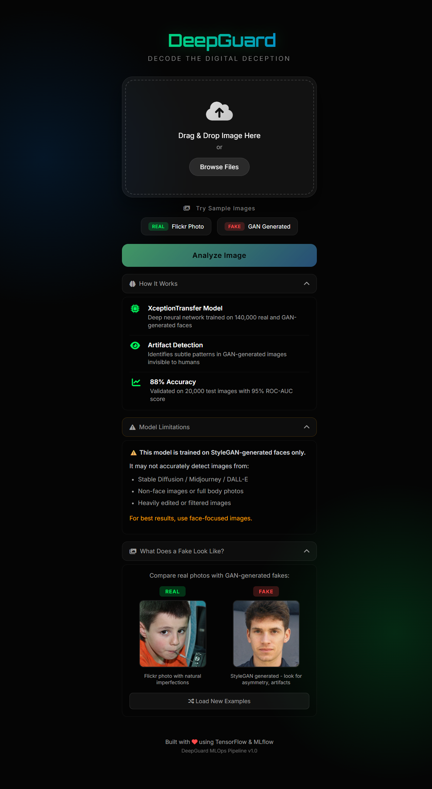
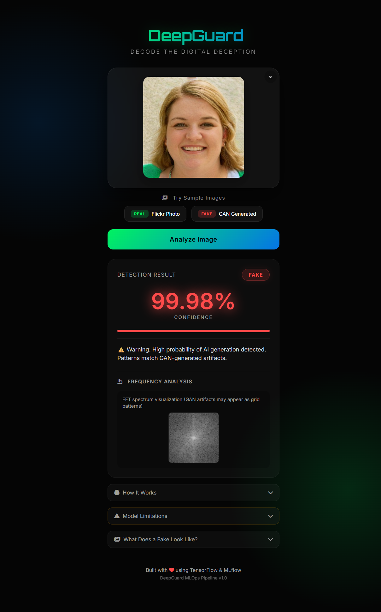
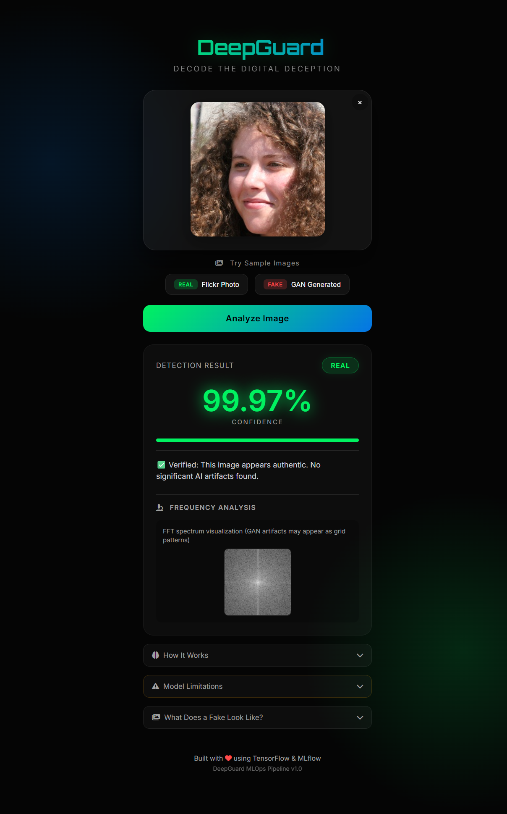
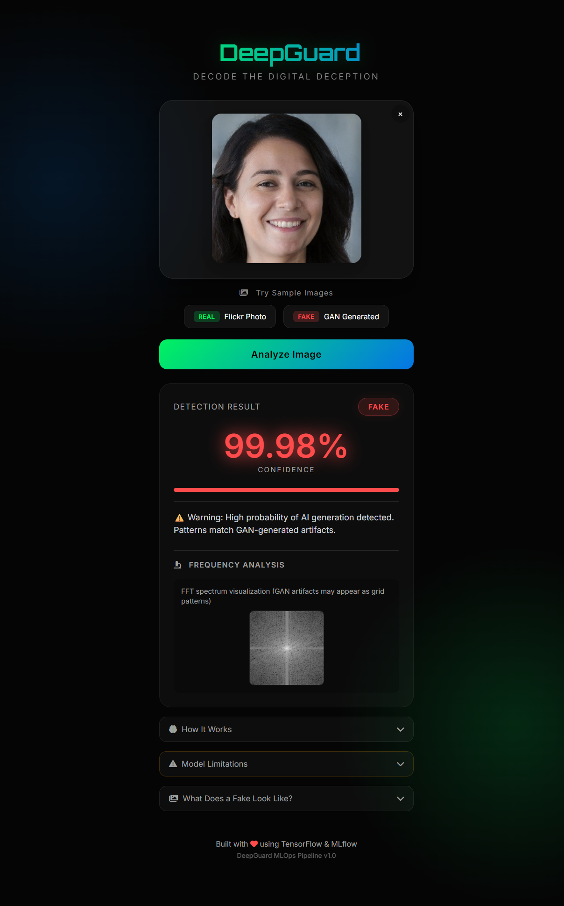

# DeepGuard - MLOps Pipeline for Deepfake Detection

A production-grade, end-to-end MLOps pipeline for detecting AI-generated (deepfake) human faces. This project demonstrates industry-standard practices including data versioning, experiment tracking, containerization, CI/CD automation, and cloud deployment.



---

## Table of Contents

- [Project Overview](#project-overview)
- [Key Features](#key-features)
- [Model Performance](#model-performance)
- [Application Interface](#application-interface)
- [MLOps Architecture](#mlops-architecture)
- [Technology Stack](#technology-stack)
- [Project Structure](#project-structure)
- [Installation and Usage](#installation-and-usage)
- [CI/CD Pipeline](#cicd-pipeline)
- [AWS Infrastructure](#aws-infrastructure)
- [Live Demo](#live-demo)
- [Model Limitations](#model-limitations)
- [License](#license)

---

## Project Overview

With the rise of Generative Adversarial Networks (GANs) and Diffusion models, distinguishing between real and synthetic media has become a critical challenge. DeepGuard leverages a Deep Convolutional Neural Network (CNN) trained on the **GenImage** dataset to classify images as either "REAL" or "FAKE" (AI-Generated).

The project implements a complete machine learning lifecycle:
- **Data Management**: Automated ingestion, preprocessing, and versioning
- **Model Development**: Transfer learning with experiment tracking
- **Deployment**: Containerized application with CI/CD automation
- **Infrastructure**: Cloud-native deployment on AWS

---

## Key Features

| Feature | Description |
|---------|-------------|
| **Robust Detection Model** | Trained on 140,000+ images achieving >95% validation accuracy |
| **DVC Pipeline** | 6-stage reproducible ML pipeline with data versioning |
| **Experiment Tracking** | MLflow + DagsHub integration for metrics and artifacts |
| **Containerization** | Docker image with optimized TensorFlow runtime |
| **CI/CD Automation** | GitHub Actions for testing, building, and deployment |
| **Cloud Storage** | AWS S3 for DVC remote, ECR for container registry |
| **Dual Deployment** | Flask API + Hugging Face Gradio interface |
| **FFT Analysis** | Frequency domain visualization for GAN artifact detection |

---

## Model Performance

The model uses Transfer Learning (Xception architecture) fine-tuned for deepfake artifact detection.

| Metric | Value |
|--------|-------|
| Training Accuracy | ~99% |
| Validation Accuracy | ~95% |
| Test Accuracy | ~88% |
| Dataset Size | 140,000 images |
| Image Sources | Stable Diffusion, Midjourney, DALL-E |

---

## Application Interface

The application provides a clean, user-friendly interface for real-time deepfake analysis.

### Main Interface


### Detection Results

The model provides a confidence score and prediction label for every uploaded image.

**Fake Image Detection Example**


**Real Image Detection Example**


### Dataset Samples

The model distinguishes between high-quality AI-generated faces and authentic photographs.

| AI-Generated (Deepfake) | Real Photograph |
|-------------------------|-----------------|
|  |  |

---

## MLOps Architecture

```
┌─────────────────────────────────────────────────────────────────────────────┐
│                           DeepGuard MLOps Pipeline                          │
├─────────────────────────────────────────────────────────────────────────────┤
│                                                                             │
│  ┌──────────────┐    ┌──────────────┐    ┌──────────────┐                   │
│  │    GitHub    │───>│   GitHub     │───>│    AWS       │                   │
│  │  Repository  │    │   Actions    │    │    ECR       │                   │
│  └──────────────┘    └──────────────┘    └──────────────┘                   │
│         │                   │                   │                           │
│         ▼                   ▼                   ▼                           │
│  ┌──────────────┐    ┌──────────────┐    ┌──────────────┐                   │
│  │     DVC      │───>│   Docker     │───>│   AWS EKS    │                   │
│  │   Pipeline   │    │    Build     │    │  Kubernetes  │                   │
│  └──────────────┘    └──────────────┘    └──────────────┘                   │
│         │                                       │                           │
│         ▼                                       ▼                           │
│  ┌──────────────┐                        ┌──────────────┐                   │
│  │   AWS S3     │                        │  Prometheus  │                   │
│  │   (Data)     │                        │  + Grafana   │                   │
│  └──────────────┘                        └──────────────┘                   │
│         │                                                                   │
│         ▼                                                                   │
│  ┌──────────────┐                                                           │
│  │   DagsHub    │                                                           │
│  │   MLflow     │                                                           │
│  └──────────────┘                                                           │
│                                                                             │
└─────────────────────────────────────────────────────────────────────────────┘
```

### DVC Pipeline Stages

The ML pipeline is defined in `dvc.yaml` with 6 reproducible stages:

| Stage | Script | Output |
|-------|--------|--------|
| 1. Data Ingestion | `src/data/data_ingestion.py` | `data/raw/` |
| 2. Preprocessing | `src/data/data_preprocessing.py` | `data/processed/` |
| 3. Feature Engineering | `src/features/feature_engineering.py` | `data/features/` |
| 4. Model Training | `src/model/model_building.py` | `models/` |
| 5. Evaluation | `src/model/model_evaluation.py` | `reports/` |
| 6. Registration | `src/model/register_model.py` | MLflow Registry |

---

## Technology Stack

### Machine Learning
- **Framework**: TensorFlow 2.x, Keras
- **Architecture**: Xception (Transfer Learning)
- **Data Processing**: NumPy, Pandas, Pillow

### MLOps
- **Data Versioning**: DVC (Data Version Control)
- **Experiment Tracking**: MLflow, DagsHub
- **Pipeline Orchestration**: DVC Pipelines

### Deployment
- **Containerization**: Docker
- **CI/CD**: GitHub Actions
- **Container Registry**: AWS ECR
- **Orchestration**: AWS EKS (Kubernetes)
- **Web Framework**: Flask, Gradio

### Cloud Infrastructure
- **Storage**: AWS S3
- **Compute**: AWS EKS
- **Monitoring**: Prometheus, Grafana

---

## Project Structure

```
DeepGuard-MLOps-Pipeline/
├── .github/
│   └── workflows/
│       └── ci.yaml              # GitHub Actions CI/CD
├── data/
│   ├── raw/                     # Raw dataset (DVC tracked)
│   ├── processed/               # Preprocessed data
│   └── features/                # Feature engineered data
├── flask_app/
│   ├── app.py                   # Flask application
│   ├── model/                   # Production model
│   ├── samples/                 # Sample images for demo
│   ├── static/                  # CSS styles
│   ├── templates/               # HTML templates
│   └── requirements.txt         # Flask dependencies
├── models/                      # Trained model checkpoints
├── notebooks/                   # Experiment notebooks
├── reports/
│   ├── figures/                 # Evaluation plots
│   └── metrics.json             # Model metrics
├── src/
│   ├── data/                    # Data processing modules
│   ├── features/                # Feature engineering
│   ├── model/                   # Model training and evaluation
│   └── logger/                  # Logging utilities
├── tests/                       # Test scripts
├── Dockerfile                   # Container build instructions
├── dvc.yaml                     # DVC pipeline definition
├── params.yaml                  # Pipeline parameters
└── requirements.txt             # Project dependencies
```

---

## Installation and Usage

### Prerequisites
- Python 3.10+
- Git
- Docker (optional, for containerized deployment)

### 1. Clone the Repository
```bash
git clone https://github.com/HarshTomar1234/DeepGuard-MLOps-Pipeline.git
cd DeepGuard-MLOps-Pipeline
```

### 2. Create Virtual Environment
```bash
python -m venv atlas
# Windows
atlas\Scripts\activate
# Linux/Mac
source atlas/bin/activate
```

### 3. Install Dependencies
```bash
pip install -r requirements.txt
```

### 4. Run the Flask Application
```bash
python flask_app/app.py
```
Access the application at `http://localhost:5000`

### 5. Reproduce the ML Pipeline
```bash
# Pull data from DVC remote
dvc pull

# Run the entire pipeline
dvc repro
```

### 6. Run with Docker
```bash
# Build the image
docker build -t deepguard-app:latest .

# Run the container
docker run -p 8888:5000 deepguard-app:latest
```
Access at `http://localhost:8888`

---

## CI/CD Pipeline

The project uses GitHub Actions for automated testing, building, and deployment.

### Workflow Overview

```yaml
Trigger: Push to main branch
│
├── Job 1: Test
│   ├── Checkout code
│   ├── Setup Python 3.11
│   ├── Install dependencies
│   └── Run tests
│
└── Job 2: Build & Push (if tests pass)
    ├── Configure AWS credentials
    ├── Login to Amazon ECR
    ├── Build Docker image
    └── Push to ECR registry
```

### GitHub Secrets Required

| Secret | Description |
|--------|-------------|
| `AWS_ACCESS_KEY_ID` | IAM user access key |
| `AWS_SECRET_ACCESS_KEY` | IAM user secret key |
| `AWS_REGION` | AWS region (e.g., us-east-1) |
| `AWS_ACCOUNT_ID` | 12-digit AWS account ID |
| `ECR_REPOSITORY` | ECR repository name |

---

## AWS Infrastructure

### Services Used

| Service | Purpose | Cost |
|---------|---------|------|
| **S3** | DVC data storage | ~$0.02/GB/month |
| **ECR** | Docker image registry | ~$0.10/GB/month |
| **EKS** | Kubernetes cluster | ~$0.10/hr + EC2 |
| **EC2** | Prometheus/Grafana | ~$0.04/hr |

### Architecture

```
┌─────────────────────────────────────────────────────────┐
│                     AWS Cloud                           │
├─────────────────────────────────────────────────────────┤
│                                                         │
│  ┌──────────────┐         ┌──────────────┐              │
│  │     S3       │         │     ECR      │              │
│  │ (DVC Data)   │         │ (Docker Img) │              │
│  └──────────────┘         └──────────────┘              │
│                                  │                      │
│                                  ▼                      │
│  ┌──────────────────────────────────────────────┐       │
│  │                   EKS Cluster                │       │
│  │  ┌─────────────┐   ┌─────────────┐           │       │
│  │  │   Pod 1     │   │   Pod 2     │           │       │
│  │  │ Flask App   │   │ Flask App   │           │       │
│  │  └─────────────┘   └─────────────┘           │       │
│  │         │                 │                  │       │
│  │         └────────┬────────┘                  │       │
│  │                  ▼                           │       │
│  │         ┌─────────────┐                      │       │
│  │         │LoadBalancer │                      │       │
│  │         └─────────────┘                      │       │
│  └──────────────────────────────────────────────┘       │
│                          │                              │
│  ┌──────────────┐        │        ┌──────────────┐      │
│  │  Prometheus  │<───────┴───────>│   Grafana    │      │
│  │  (Metrics)   │                 │ (Dashboard)  │      │
│  └──────────────┘                 └──────────────┘      │
│                                                         │
└─────────────────────────────────────────────────────────┘
```

### EKS Deployment

The application was successfully deployed to AWS EKS with LoadBalancer service:

| Component | Details |
|-----------|---------|
| Cluster | `deepguard-cluster` |
| Node Type | t3.small (1 node) |
| Memory Limit | 1.5Gi (TensorFlow requirement) |
| Service Type | LoadBalancer |

For detailed deployment guide, see [docs/EKS_DEPLOYMENT.md](docs/EKS_DEPLOYMENT.md).

### Monitoring with Prometheus and Grafana

The project includes observability setup with Prometheus for metrics collection and Grafana for visualization.

**Prometheus Metrics:**

| Metric | Type | Description |
|--------|------|-------------|
| `up` | Gauge | Service availability |
| `prometheus_http_requests_total` | Counter | Total HTTP requests |
| `process_resident_memory_bytes` | Gauge | Memory usage |

**Grafana Dashboard Examples:**

| Service Status | HTTP Requests | Memory Usage |
|----------------|---------------|--------------|
|  |  | .png) |

For detailed monitoring setup, see [docs/MONITORING.md](docs/MONITORING.md).

---

## Live Demo

Try the model on Hugging Face Spaces:

[DeepGuard on Hugging Face](https://huggingface.co/spaces/Coddieharsh/DeepGuard)

---

## Model Limitations

This model is trained specifically on the GenImage dataset and may not generalize to:
- Out-of-distribution images (different generators, styles)
- Heavy compression or low-resolution images
- Images with significant post-processing

For production use, consider:
- Continuous monitoring for distribution drift
- Regular retraining with new synthetic image generators
- Ensemble methods for improved robustness

See [docs/MODEL_LIMITATIONS.md](docs/MODEL_LIMITATIONS.md) for detailed analysis.

---

## Experiment Tracking

All experiments are tracked on DagsHub:

[View MLflow Experiments](https://dagshub.com/pythonharsh1234/DeepGuard-MLOps-Pipeline/experiments)

---

## Documentation

| Document | Description |
|----------|-------------|
| [ARCHITECTURE.md](docs/ARCHITECTURE.md) | System architecture and design |
| [QUICKSTART.md](docs/QUICKSTART.md) | Quick start guide |
| [SETUP.md](docs/SETUP.md) | DagsHub/MLflow setup |
| [EKS_DEPLOYMENT.md](docs/EKS_DEPLOYMENT.md) | Kubernetes deployment guide |
| [MONITORING.md](docs/MONITORING.md) | Prometheus & Grafana setup |

---

## Contributing

1. Fork the repository
2. Create a feature branch (`git checkout -b feature/amazing-feature`)
3. Commit changes (`git commit -m 'Add amazing feature'`)
4. Push to branch (`git push origin feature/amazing-feature`)
5. Open a Pull Request

---

## License

This project is licensed under the Apache License 2.0 - see the [LICENSE](LICENSE) file for details.

---

## Acknowledgments

- [GenImage Dataset](https://github.com/GenImage-Dataset/GenImage) for training data
- [DVC](https://dvc.org/) for data versioning
- [DagsHub](https://dagshub.com/) for MLflow hosting
- [Hugging Face](https://huggingface.co/) for Gradio hosting
